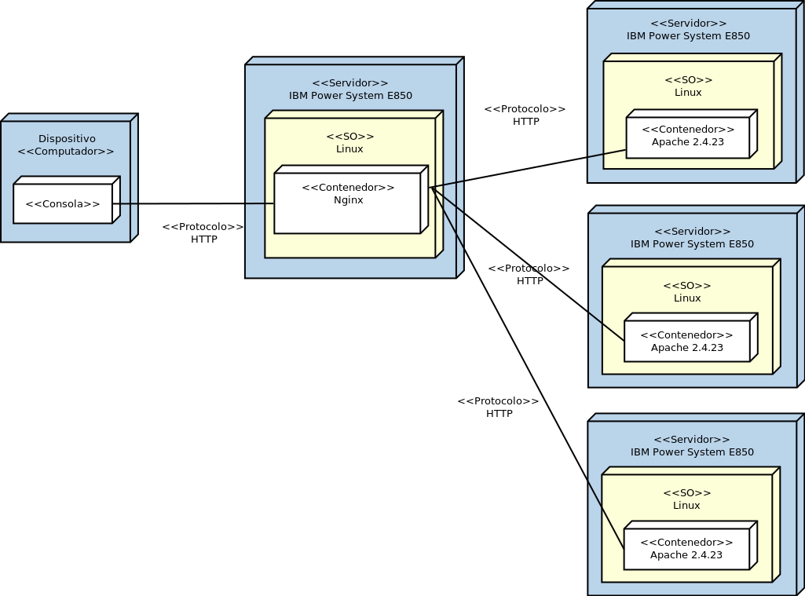

# Primer Parcial Distribuidos
## Rodrigo Rivera


### Paso a paso:

#### Comandos linux necesarios para aprovisionamiento de servicios.
<p align="center">
  
</p>


Para poder realizar el sistema planteado en la arquitectura, esto es, un balanceador de cargas que recibe una petición de un cliente y apunta a tres servidores web para atender la solicitud, se realiza la siguiente forma:


#### Balanceador de cargas: Nginx

Para poder atender a las peticiones, Nginx recibirá dichas peticiones por el puerto 8080 por ende se debe habilitar con el siguiente comando.
``` sh
iptables -I INPUT 5 -p tcp -m state --state NEW -m tcp --dport 8080 -j ACCEPT
service iptables save
```

Una vez habilitado esto, se puede pasar a instalar el servicio.

``` sh
apt-get update nginx
apt-get install nginx -y
```

Una vez instalado, el paso siguiente es modificar el archivo de configuración de nginx con lo siguiente:
``` sh
worker_processes 4;
 
events { worker_connections 1024; }
 
http {
    sendfile on;
 
    upstream app_servers {
        server web1;
        server web2;
        server web3;
    }
 
    server {
        listen 80;
 
        location / {
            proxy_pass         http://app_servers;
            proxy_redirect     off;
            proxy_set_header   Host $host;
            proxy_set_header   X-Real-IP $remote_addr;
            proxy_set_header   X-Forwarded-For $proxy_add_x_forwarded_for;
            proxy_set_header   X-Forwarded-Host $server_name;
        }
    }
}
```
En este archivo se especifican varias cosas, las más relevantes son el grupo de servidores a los cuales apuntará para distribuir la carga (web1,web2,web3)  y la forma en que lo hará (round-robin). 

Servidores web:
``` sh
Instalar httpd:
apt-get install httpd -y
```
Abrir el puerto 80 para atender a las solicitudes o peticiones http:
``` sh
iptables -I INPUT 5 -p tcp -m state --state NEW -m tcp --dport 80 -j ACCEPT
service iptables save
```


### Estructura del parcial

<p align="center">
  
</p>

<p align="center">
  
</p>

<p align="center">
  
</p>

### DockerFiles

#### DockerFile Nginx

```
FROM nginx

# Remove the default Nginx configuration file
RUN rm -v /etc/nginx/nginx.conf

# Copy a configuration file from the current directory
ADD nginx.conf /etc/nginx/

# Append "daemon off;" to the beginning of the configuration
RUN echo "daemon off;" >> /etc/nginx/nginx.conf


# Set the default command to execute
# when creating a new container
CMD service nginx start
```


#### DockerFile Web
En este punto cabe aclarar que se debe hacer lo mismo para las dos carpetas restantes de servidores web (web2, web3).

```
FROM httpd
ADD index.html /usr/local/apache2/htdocs/index.html
```

##### Index.html

```html
<!DOCTYPE html>
<html>
<head>
<title>Examen 2</title>
</head>
<body bgcolor="yellow">

<h1>Web 1</h1>

</body>
</html>
```

### docker-compose.yml

El docker-compose.yml contiene lo siguiente.

```
version: '2'
 
services:
  web1:
    build:
      context:  ./web1
      dockerfile: Dockerfile  
    volumes:
      - web_volumes:/usr/local/apache2/htdocs

  web2:
    build:
      context:  ./web2
      dockerfile: Dockerfile  
    volumes:
      - web_volumes:/usr/local/apache2/htdocs

  web3:
    build:
      context:  ./web3
      dockerfile: Dockerfile
    volumes:
      - web_volumes:/usr/local/apache2/htdocs
 
  proxy:
    build:
      context:  ./nginx
      dockerfile: Dockerfile
    ports:
      - "8080:80"
    volumes:
      - nginx_volumes:/etc/nginx/nginx_volumes

volumes:
    web_volumes:
    
    nginx_volumes:
```

### Pruebas de funcionamiento

<p align="center">
  
</p>

<p align="center">
  
</p>

<p align="center">
  
</p>

<p align="center">
  
</p>

<p align="center">
  
</p>
